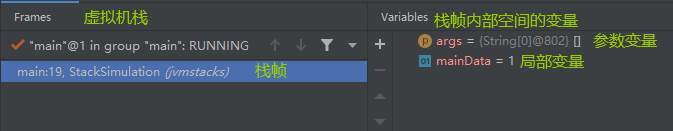
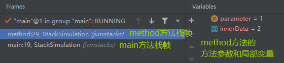
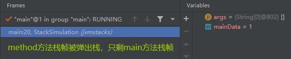
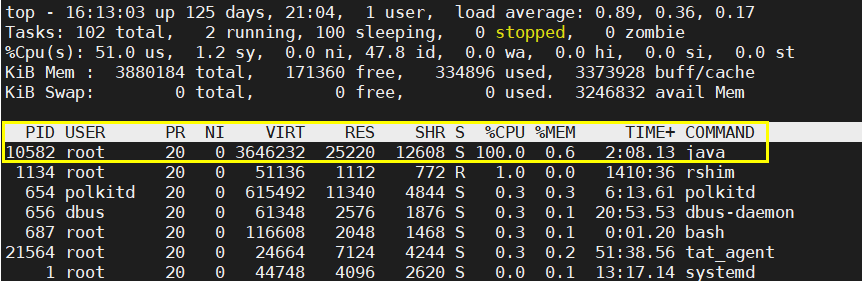
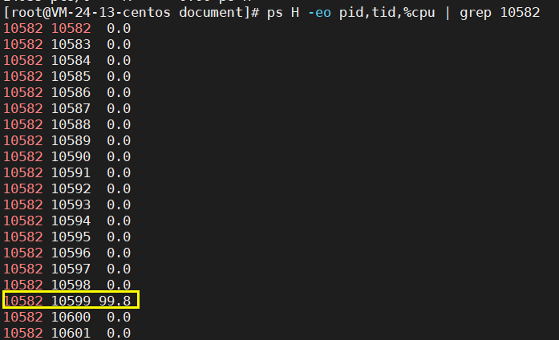
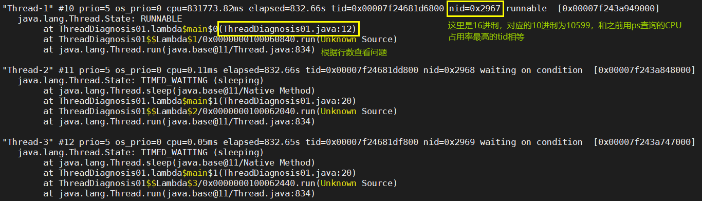
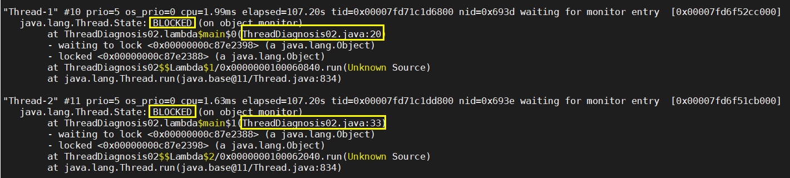
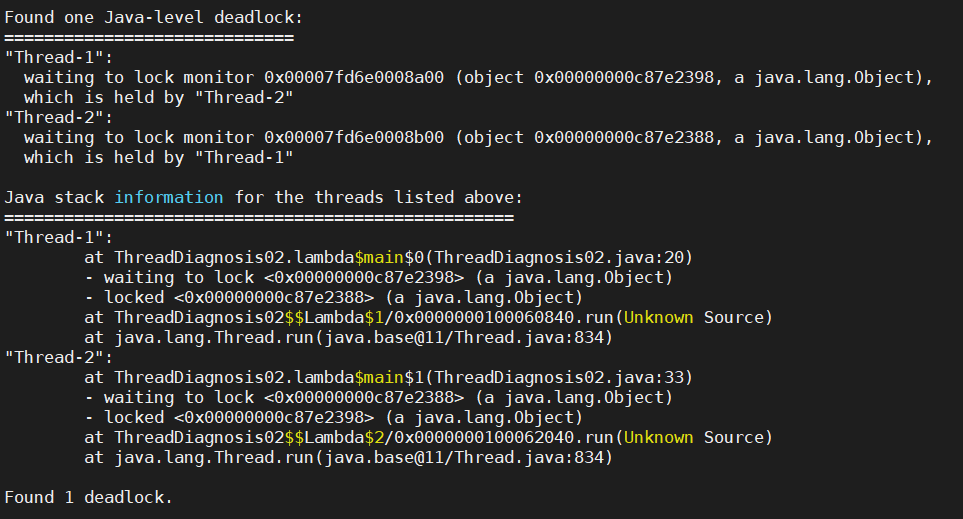

# JVM Stacks

JVM Stacks 虚拟机栈，他属于 JVM 内存结构的范畴，既然他叫栈，那么就跟数据结构中的栈是一样的，遵循**后进先出**的原则。我们要弄清楚几个词。

- JVM 虚拟机栈：是**线程**运行时所需要的内存空间，每个线程都有自己独立的栈空间。随着线程的创建而创建，随着线程的销毁而销毁。
- 栈帧：JVM 虚拟机栈中的元素，java程序每调用一个方法，就会生成一个栈帧，并且压入虚拟机栈，栈帧也是一个内存空间，存放了每个方法所需要**参数，局部变量，返回地址**等等。当方法调用完成时，会自动弹出当前栈帧，释放空间。
- 活动栈帧：每个**线程**只能有一个活动栈帧。

## 虚拟机栈演示

我们可以用代码模拟一下 虚拟机栈的运行过程。

```java
/**
 * 模拟虚拟机栈，模拟栈帧的压入和弹出
 *
 * @author Qiutian Dog
 * @date 2022/3/11
 */
public class StackSimulation {
    /**
     * main 方法也是一个方法，调用时会创建栈帧
     * @param args 参数
     */
    public static void main(String[] args) {
        // 局部变量
        int mainData = 1;

        // 调用其他方法，为该方法生成一个栈帧
        method(mainData);
    }

    /**
     * 普通方法
     * @param parameter 方法的参数
     */
    public static void method(int parameter) {
        // 局部变量
        int innerData = 2;
    }
}
```

1. 首先，我们在main里面打上断点，开始调试。



- 左边：虚拟机中已经有了一个栈帧，是main方法的栈帧。
- 右边：main方法栈帧内部的变量，可以看到不仅有方法参数还有方法内局部变量。

2. 单点调试，进入method方法。



- 左边：虚拟机栈中压入了新的栈帧，method方法栈帧，并且在main方法栈帧之上，符合栈的逻辑结构。
- 右边：method方法的方法参数和局部变量。

3. 继续调试，到执行完method方法。



- 注意已经到了main:20，而不是之前main:19，这代表的是执行到的代码行数。

## 常见问题

1. 垃圾回收是否涉及栈内存？

   不涉及，栈内存中消耗内存的主要是栈帧，当一个方法执行完成之后，虚拟机栈会自动将方法对应的栈帧弹出虚拟机栈，释放空间。

2. 栈内存越大越好吗？

   不是，因为物理内存是固定的，而每一个线程都拥有对应的栈空间，所以栈内存越大，相对于的线程数就越少。

   **注**：可以在 java 运行命令中使用 -Xss 设置栈内存的大小，例：-Xss256k -Xss1m

3. 方法内的局部变量是否线程安全？

   - 如果方法内部的局部变量不作为**返回值**或者**参数**，他就是线程安全的。
   - 如果局部变量**引用了对象**，并且作为**返回值**或**参数**，就需要考虑线程安全的问题。

## 内存溢出

导致栈内存溢出的情况只有两种：

1. 栈帧过多，超出了栈的内存范围。

   常见的在于递归调用中没有设置正确的终止条件，很容易就会导致栈内存溢出。

   ```java
   /**
    * 递归调用 不设置终止条件，导致栈帧过多，超出栈的内存范围，最终导致栈内存溢出
    * java.lang.StackOverflowError
    */
   public static void recursion() {
       // 不设置终止条件
       recursion();
   }
   ```

2. 栈帧过大，超出了栈的内存范围。

   这种情况很少见，因为局部变量都是占很小的内存空间，很难把整个虚拟机栈填满。

   ```java
   /**
    * 栈帧过大 超出栈的内存范围 导致栈内存溢出
    * java.lang.StackOverflowError
    */
   public static void overElement() {
       int var1 = 0;
       // -- 若干个变量, 不可以是对象，对象的话就会放在堆内存而不是栈内存。
       int varn = 0;
   }
   ```

## 线程运行诊断 

### 案例1：CPU占用过多。

解决方法：

1. 这里我用的是CentOS7.6的操作系统，首先，用top命令**定位到进程**。

```bash
top
top 命令可以查看当前所有进程的运行状态
```



可以看到进程PID为10582的 java 进程CPU占用率高达100%，这是第一步，第二步我们要定位到是哪个线程造成的。


2. 使用ps命令定位到线程

```bash
ps H -eo pid,tid,%cpu | grep 进程ID
ps 可以查看线程对CPU的占用情况
H 是打印进程里的所有线程
-eo 是规定要输出的详细信息（这里是 pid,tid,%cpu）
grep 在输出结果中查询有结果和 进程ID 相关的信息
```



我们可以看到 线程ID为10599的线程，CPU占用率最高。接着我们利用java自带的工具jstack，查看java程序的线程执行情况。


3. 使用jstack命令

```bash
jstack 进程ID
```



将用ps命令查出来的tid转化为十六进制，和jstack查询出来的线程信息的nid进行比对，可以查看出问题的代码的行数。再回到代码中进行问题分析即可。


### 案例2：程序运行很长时间没有结果。

同样的，我们最主要的还是利用jstack命令查看java程序的运行状态。这里我就直接利用jstack命令。



可以看到有两个线程处于锁住的状态，对应的代码行数也已经给出。只需要去对应行数检查一下即可。另外，在jstack的最下方，也给出了jstack的分析。




**善用jstack！！**