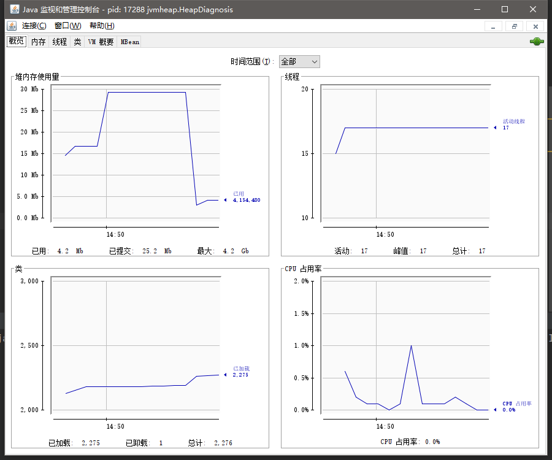
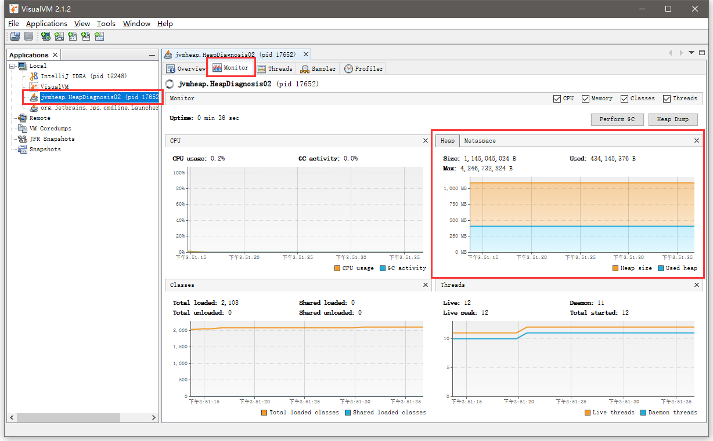
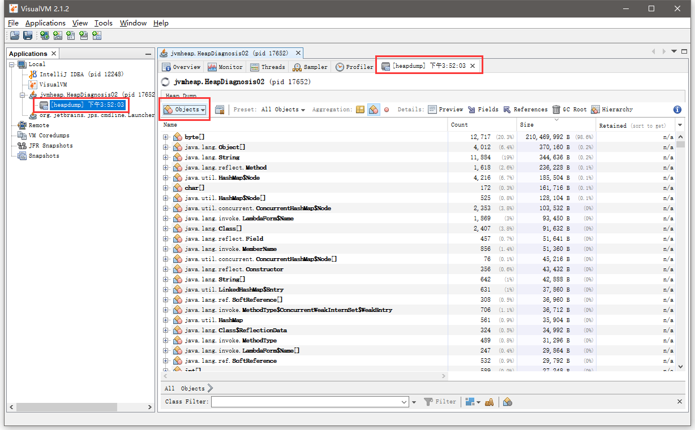
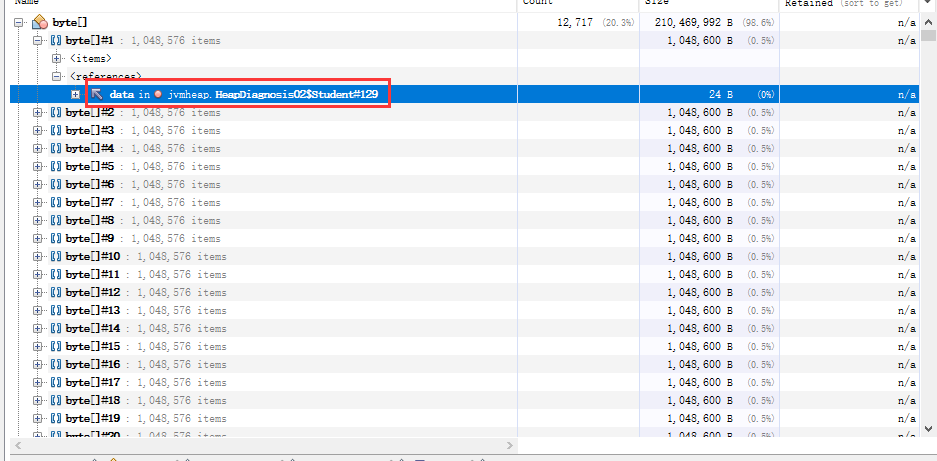

# Heap（堆）

所有的对象实例都存放在堆里面，主要存放的都是**对象实例**和**数组**。

- 特点：他是**线程共享**的，堆中的对象都需要考虑线程安全问题。
- 他存在垃圾回收机制（GC）。

## 堆内存溢出

一般的堆内存溢出是因为堆中的对象实例过大或者过多。我们可以用个例子来模拟一下。

```java
import java.util.ArrayList;
import java.util.List;

/**
 * 演示堆溢出的情况
 * 注：可以用 -Xmx 来控制堆内存的大小
 *     如 -Xmx8m
 *
 * @author Qiutian Dog
 * @date 2022/3/14
 */
public class HeapOver {
    public static void main(String[] args) {
        try {
            List<String> list = new ArrayList<>();
            String s = "QiutianDog";
            while (true) {
                // 用巨大的对象实例撑爆堆
                list.add(s);
            }
        } catch (Exception e) {
            // java.lang.OutOfMemoryError: Java heap space
            e.printStackTrace();
        }
    }
}
```

可以看到最后报了java.lang.OutOfMemoryError: Java heap space。说明java的堆空间不足了。

## 堆内存诊断

合理利用工具，对堆内存的情况进行分析诊断。

先给出一个演示代码。模拟堆内存居高不下的情况。

```java
/**
 * 模拟堆内存高居不下的情况。进行堆内存诊断。
 *
 * @author Qiutian Dog
 * @date 2022/3/14
 */
public class HeapDiagnosis01 {
    public static void main(String[] args) {
        try {
            System.out.println("init!");
            Thread.sleep(30 * 1000);
            byte[] arr = new byte[1024 * 1024 * 10];
            System.out.println("create over!");
            Thread.sleep(30 * 1000);
            arr = null;
            System.gc();
            System.out.println("gc over!");
            Thread.sleep(3600 * 1000);
        } catch (InterruptedException e) {
            e.printStackTrace();
        }
    }
}
```

现在开始heap内存诊断。

1. 查看系统中正在运行的java**进程**。

   - jps 命令，可以查看系统用正在运行的java程序，也可以用之前进行栈诊断时使用的top或者ps命令。

   ```bash
   E:\IdeaProjects\jvm-learning>jps
   15584 Launcher
   17040 Jps
   12248
   11308 HeapDiagnosis01
   ```

   可以看到PID是11308的进程，是我们刚刚运行的模拟代码。

2. 使用jmap命令分析堆内存情况。**注**：openJDK11取消了jmap命令的-heap参数，如果要使用jmap -heap，请使用jhsdb jmap命令。

   下面的第一次使用jmap命令查看堆的内存情况的信息。

   ```bash
   E:\IdeaProjects\jvm-learning>jhsdb jmap --heap --pid 11308
   Attaching to process ID 11308, please wait...
   Debugger attached successfully.
   Server compiler detected.
   JVM version is 11.0.8+10-LTS
   
   using thread-local object allocation.
   Garbage-First (G1) GC with 10 thread(s)
   
   Heap Configuration:
      MinHeapFreeRatio         = 40
      MaxHeapFreeRatio         = 70
      MaxHeapSize              = 4246732800 (4050.0MB)
      NewSize                  = 1363144 (1.2999954223632812MB)
      MaxNewSize               = 2548039680 (2430.0MB)
      OldSize                  = 5452592 (5.1999969482421875MB)
      NewRatio                 = 2
      SurvivorRatio            = 8
      MetaspaceSize            = 21807104 (20.796875MB)
      CompressedClassSpaceSize = 1073741824 (1024.0MB)
      MaxMetaspaceSize         = 17592186044415 MB
      G1HeapRegionSize         = 1048576 (1.0MB)
   
   # 主要查看Heap Usage 中的G1 Heap: uesd情况。第一次什么都没做的情况下已经有了4M.
   Heap Usage:
   G1 Heap:
      regions  = 4050
      capacity = 4246732800 (4050.0MB)
      used     = 4194304 (4.0MB)
      free     = 4242538496 (4046.0MB)
      0.09876543209876543% used
   G1 Young Generation:
   Eden Space:
      regions  = 4
      capacity = 27262976 (26.0MB)
      used     = 4194304 (4.0MB)
      free     = 23068672 (22.0MB)
      15.384615384615385% used
   Survivor Space:
      regions  = 0
      capacity = 0 (0.0MB)
      used     = 0 (0.0MB)
      free     = 0 (0.0MB)
      0.0% used
   G1 Old Generation:
      regions  = 0
      capacity = 239075328 (228.0MB)
      used     = 0 (0.0MB)
      free     = 239075328 (228.0MB)
      0.0% used
   ```

   再来看后两次的情况：**明显看到堆空间的增加和减少**。

   ```bash
   # 创建对象时候
   Heap Usage:
   G1 Heap:
      regions  = 4050
      capacity = 4246732800 (4050.0MB)
      used     = 15728640 (15.0MB)
      free     = 4231004160 (4035.0MB)
      0.37037037037037035% used
   
   # 主动gc回收堆空间时
   Heap Usage:
   G1 Heap:
      regions  = 4050
      capacity = 4246732800 (4050.0MB)
      used     = 1477208 (1.4087753295898438MB)
      free     = 4245255592 (4048.59122467041MB)
      0.0347845760392554% used
   ```

3. 使用jconsole工具进行进程监控，在命令行输入jconsole打开工具。检测进程。



左上角的堆内存使用量，可以看到有一个类凸字，堆内存上升阶段是进行了一个数组对象的创建，而下降阶段是主动进行了堆内存回收。

4. 使用Jvisualvm工具。在高版本的openJDK当中已经移除了这个工具，需要自己独立去下载。http://visualvm.github.io/download.html。

先准备一个模拟堆内存高居不下的代码。

```java
import java.util.ArrayList;
import java.util.List;

/**
 * 模拟堆内存高居不下的情况。进行堆内存诊断。
 *
 * @author Qiutian Dog
 * @date 2022/3/14
 */
public class HeapDiagnosis02 {
    public static void main(String[] args) {
        try {
            List<Student> list = new ArrayList<>();
            for (int i = 0; i < 200; i++) {
                list.add(new Student("小明", i));
            }
            Thread.sleep(3600 * 1000);
        } catch (Exception e) {
            e.printStackTrace();
        }
    }
    
    static class Student{
        String name;
        Integer age;
        
        public Student(String name, Integer age) {
            this.name = name;
            this.age = age;
        }
    }
}
```

启动后在命令行输入jvisualvm打开工具，或者直接双击visualvm.exe(配置过etc/visualvm.conf里的jdk路径)。选择要监控的进程。



右边红框就是堆的内存情况，单击右上角的按钮【Heap Dump】抓取堆内存快照。



在快照中选择查看对象信息，可以发现byte[]对象在正在使用的堆内存中占据了98%，可以点进去看一眼。



发现这些byte[]都来自Student对象，基本上就可以断定是Student对象没有被释放掉导致堆内存高居不下的了。