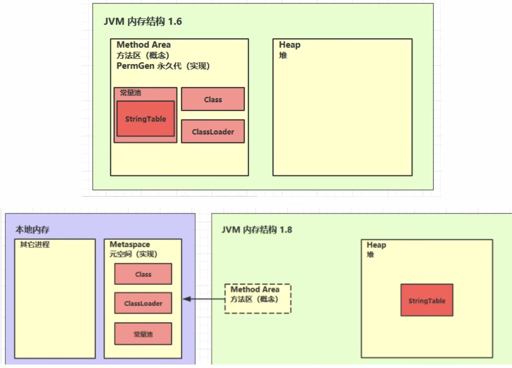

# Method Area 方法区

定义：方法区是一个所有java虚拟线程一个**共享**的区域，与堆一样，是一个线程共享的区域。他存储了跟类的结构相关的一些信息，比如类的成员变量（field），方法数据（method date），以及成员方法和构造器的代码，和特殊方法（类构造器）的代码。

方法区在虚拟机启动时被创建。在逻辑是是堆的组成部分（1.8之前叫永久代，1.8之后叫元空间，用的是本地内存，而不是堆内存）。如果方法区在申请内存时，内存不够用类，也会抛出outOfMemory的异常。


## 内存溢出

因为在1.8之后，方法区使用系统内存，一般很难造成溢出的情况，所以需要手动设定JVM参数。
```
-XX:MaxMetaspaceSize=8m
```
演示代码：使用类加载器，不断加载类，类的信息会存进方法区。最终造成元空间内存溢出
```java
import jdk.internal.org.objectweb.asm.ClassWriter;
import jdk.internal.org.objectweb.asm.Opcodes;

/**
 * 演示元空间内存溢出
 * -XX:MaxMetaspaceSize=8m
 * <p>
 * ClassLoader 可以用来加载类的二进制字节码
 */
public class MethodOutMemory extends ClassLoader {
    public static void main(String[] args) {
        int j = 0;
        try {
            MethodOutMemory methodOutMemory = new MethodOutMemory();
            for (int i = 0; i < 10000; i++, j++) {
                // ClassWriter 用代码的方式生成类的字节码
                ClassWriter cw = new ClassWriter(0);
                // Opcodes.V1_8 代表类的版本号，Opcodes.ACC_PUBLIC 类的访问修饰符， 类的名字， null 包名， java/lang/Object 父类， null 实现的接口名称
                cw.visit(Opcodes.V1_8, Opcodes.ACC_PUBLIC, "Class" + i, null, "java/lang/Object", null);
                byte[] code = cw.toByteArray();
                // 加载类
                methodOutMemory.defineClass("Class" + i, code, 0, code.length);
            }
        } finally {
            System.out.println(j);
        }
    }
}
```
输出结果：
```
3331
Exception in thread "main" java.lang.OutOfMemoryError: Compressed class space
at java.lang.ClassLoader.defineClass1(Native Method)
at java.lang.ClassLoader.defineClass(ClassLoader.java:756)
at java.lang.ClassLoader.defineClass(ClassLoader.java:635)
at jvmmethodarea.MethodOutMemory.main(MethodOutMemory.java:27)
```

## 场景
* spring
* mybatis