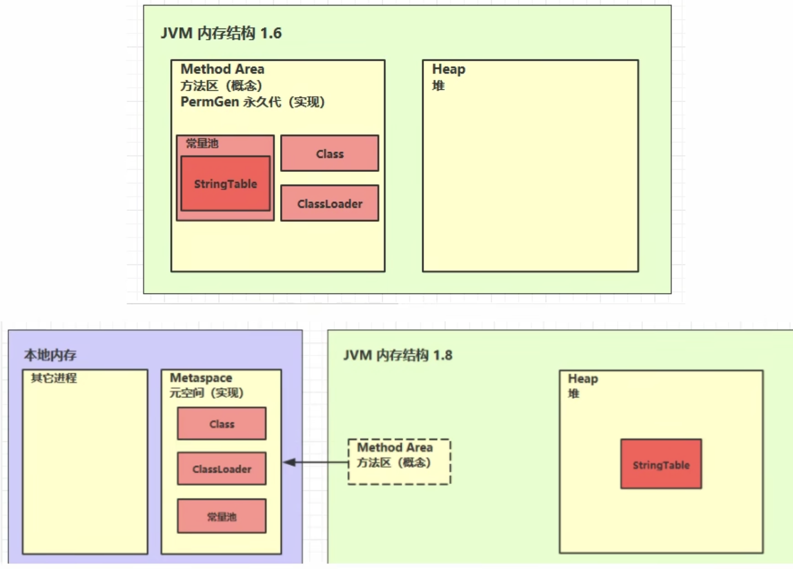

# StringTable 串池

## 字符串声明
样例：
```
// java 代码
String s1 = "a";
String s2 = "b";
String s3 = "ab";

// 反编译结果
Constant pool:
    #2 = String             #25            // a
    #3 = String             #26            // b
    #4 = String             #27            // ab
Code:
  stack=1, locals=4, args_size=1
     0: ldc           #2                  // String a
     2: astore_1
     3: ldc           #3                  // String b
     5: astore_2
     6: ldc           #4                  // String ab
     8: astore_3
     9: return
  LineNumberTable:
    line 11: 0
    line 12: 3
    line 13: 6
    line 14: 9
  LocalVariableTable:
    Start  Length  Slot  Name   Signature
        0      10     0  args   [Ljava/lang/String;
        3       7     1    s1   Ljava/lang/String;
        6       4     2    s2   Ljava/lang/String;
        9       1     3    s3   Ljava/lang/String;
```
分析：常量池中的信息，会被加载到运行时的常量池中，这时 a b ab都是常量池中的符号，还没有变成 java 字符串对象。

当执行到 ldc #2 时，会把 a 符号，变为 "a" 字符串对象。同时会在StringTable（串池，堆中，注意区分，常量池是在元空间）中存储，串池本身是个HashTable。
此时串池中为：
```
StringTable = [ "a" ]
```
当执行到 ldc #3 时，会把 b 符号，变为 "b" 字符串对象，同时将 "b 字符串对象加入串池。此时串池为：
```
StringTable = [ "a", "b" ]
```
最后一步同上，最后串池会变为：
```
StringTable = [ "a", "b", "ab" ]
```

------
## 字符串拼接
### 对象拼接
修改一下样例的代码，再反编译一下：
```
// java 代码
String s1 = "a";
String s2 = "b";
String s3 = "ab";
String s4 = s1 + s2;

// 反编译结果
Code:
  stack=2, locals=5, args_size=1
     0: ldc           #2                  // String a
     2: astore_1
     3: ldc           #3                  // String b
     5: astore_2
     6: ldc           #4                  // String ab
     8: astore_3
     9: new           #5                  // class java/lang/StringBuilder
    12: dup
    13: invokespecial #6                  // Method java/lang/StringBuilder."<init>":()V
    16: aload_1
    17: invokevirtual #7                  // Method java/lang/StringBuilder.append:(Ljava/lang/String;)Ljava/lang/StringBuilder;
    20: aload_2
    21: invokevirtual #7                  // Method java/lang/StringBuilder.append:(Ljava/lang/String;)Ljava/lang/StringBuilder;
    24: invokevirtual #8                  // Method java/lang/StringBuilder.toString:()Ljava/lang/String;
    27: astore        4
    29: return
  LineNumberTable:
    line 11: 0
    line 12: 3
    line 13: 6
    line 14: 9
    line 15: 29
  LocalVariableTable:
    Start  Length  Slot  Name   Signature
        0      30     0  args   [Ljava/lang/String;
        3      27     1    s1   Ljava/lang/String;
        6      24     2    s2   Ljava/lang/String;
        9      21     3    s3   Ljava/lang/String;
       29       1     4    s4   Ljava/lang/String;
```
可以看到前三步都是一样的。但是第四步却很复杂：
1. 创建一个 StringBuilder 对象
2. 调用 StringBuilder 对象的构造方法
3. aloald_1 从局部变量表（LocalVariableTable）中获取slot为1的数据，这里指s1也就是串池中的 "a" 对象
4. 调用 StringBuilder中的 append 方法
5. aloald_2 从局部变量表（LocalVariableTable）中获取slot为2的数据，这里指s1也就是串池中的 "b" 对象
6. 调用 StringBuilder中的 append 方法
7. 调用 StringBuilder中的 toString 方法，生成新的字符串对象 "ab"
8. 将 "ab" 字符串对象存入局部变量表中。

**注**：要注意区分 astore_1 和 astore 4，前者 上存入串池中（元空间），后者是存入局部变量表（堆）中。地址不一样。

### 字符拼接
修改一下代码
```
// java 代码
String s1 = "a";
String s2 = "b";
String s3 = "ab";
String s4 = s1 + s2;

// 反编译结果
Code:
  stack=2, locals=6, args_size=1
     0: ldc           #2                  // String a
     2: astore_1
     3: ldc           #3                  // String b
     5: astore_2
     6: ldc           #4                  // String ab
     8: astore_3
     9: new           #5                  // class java/lang/StringBuilder
    12: dup
    13: invokespecial #6                  // Method java/lang/StringBuilder."<init>":()V
    16: aload_1
    17: invokevirtual #7                  // Method java/lang/StringBuilder.append:(Ljava/lang/String;)Ljava/lang/StringBuilder;
    20: aload_2
    21: invokevirtual #7                  // Method java/lang/StringBuilder.append:(Ljava/lang/String;)Ljava/lang/StringBuilder;
    24: invokevirtual #8                  // Method java/lang/StringBuilder.toString:()Ljava/lang/String;
    27: astore        4
    29: ldc           #4                  // String ab
    31: astore        5
    33: return
  LineNumberTable:
    line 11: 0
    line 12: 3
    line 13: 6
    line 14: 9
    line 15: 29
    line 16: 33
  LocalVariableTable:
    Start  Length  Slot  Name   Signature
        0      34     0  args   [Ljava/lang/String;
        3      31     1    s1   Ljava/lang/String;
        6      28     2    s2   Ljava/lang/String;
        9      25     3    s3   Ljava/lang/String;
       29       5     4    s4   Ljava/lang/String;
       33       1     5    s5   Ljava/lang/String;
```
这里可以发现 s5 是直接 ldc #4, 是直接从串池中拿取 "ab" 对象，并且再将 "ab" 对象存入局部变量表中。
因为第一次 ldc #4 的时候，常量池中只有 ab 这个字符，所以此时会将 ab 字符转化为 "ab" 字符串对象，存入串池中。
在第二次获取的时候，就可以直接从串池中拿到，所以对象的地址是同一个。

至于为什么 "a" + "b"直接变成了"ab"，是因为编译器在编译时就已经做了优化。

## intern

主动将串池中还没有的字符串对象放入串池。
```
// java 代码
String s = new String("a") + new String("b");
String s2 = s.intern();
System.out.println(s2 == "ab");

// 反编译结果
Code:
  stack=4, locals=3, args_size=1
     0: new           #2                  // class java/lang/StringBuilder
     3: dup
     4: invokespecial #3                  // Method java/lang/StringBuilder."<init>":()V
     7: new           #4                  // class java/lang/String
    10: dup
    11: ldc           #5                  // String a
    13: invokespecial #6                  // Method java/lang/String."<init>":(Ljava/lang/String;)V
    16: invokevirtual #7                  // Method java/lang/StringBuilder.append:(Ljava/lang/String;)Ljava/lang/StringBuilder;
    19: new           #4                  // class java/lang/String
    22: dup
    23: ldc           #8                  // String b
    25: invokespecial #6                  // Method java/lang/String."<init>":(Ljava/lang/String;)V
    28: invokevirtual #7                  // Method java/lang/StringBuilder.append:(Ljava/lang/String;)Ljava/lang/StringBuilder;
    31: invokevirtual #9                  // Method java/lang/StringBuilder.toString:()Ljava/lang/String;
    34: astore_1
    35: aload_1
    36: invokevirtual #10                 // Method java/lang/String.intern:()Ljava/lang/String;
    39: astore_2
    40: getstatic     #11                 // Field java/lang/System.out:Ljava/io/PrintStream;
    43: aload_2
    44: ldc           #12                 // String ab
    46: if_acmpne     53
    49: iconst_1
    50: goto          54
    53: iconst_0
    54: invokevirtual #13                 // Method java/io/PrintStream.println:(Z)V
    57: return
```
可以看到在执行 new String("a") + new String("b") 的时候，它先是构造了一个StringBuilder对象，再依次append字符串a和字符串b，本身"a"与"b"属于字面量，在串池中有相应的对象。
然而新构造的"ab"对象属于toString创建出来的，没有放入串池，而是在堆中。前面的例子已经证明，对象拼接的结果不会放入串池。后面执行s.intern，将"ab"对象放入了串池中。

intern方法可以将串池中还没有的字符串对象放入串池，如果串池中有该对象，就会返回串池中的对象。

## StringTable 位置



StringTable在1.8中是堆中划分出来的一块虚拟区域，实际上还是存在与堆中，只是逻辑上属于StringTable。

可以用一个例子来测试一下
```java
    List<String> list = new ArrayList<>();
    long max = 26000L;
    long index = 0;
    try {
        for (index = 0; index < max; index++) {
            list.add(String.valueOf(index).intern());
        }
    } catch (Exception e) {
        e.printStackTrace();
    } finally {
        System.out.println(index);
    }

    // 设置堆的内存大小 -Xmx2m -Xms0m
    Exception in thread "main" java.lang.OutOfMemoryError: Java heap space
```
可以看见 最后报的异常为Java heap space，为堆内存溢出。

## StringTable 垃圾回收

因为StringTable在物理上属于堆中，所以跟堆一样享有内存回收机制（GC），当堆内存不够时，就会触发垃圾回收。

```java
/**
 * 展示StringTable会存在垃圾回收，不停的创建字符串对象，放入堆中，设置堆的最大内存。
 * -Xmx4m -XX:+PrintStringTableStatistics -XX:+PrintGCDetails -verbose:gc
 * PrintStringTableStatistics 启动打印StringTable信息
 * PrintGCDetails 打印 GC 回收信息
 */
long max = 10000L;
long index = 0;
try {
    for (index = 0; index < max; index++) {
        String.valueOf(index).intern();
    }
} catch (Exception e) {
    e.printStackTrace();
} finally {
    System.out.println(index);
}

// 输出结果（部分）
[GC (Allocation Failure) [PSYoungGen: 510K->480K(1024K)] 510K->496K(3584K), 0.0008842 secs] [Times: user=0.01 sys=0.00, real=0.00 secs]
[GC (Allocation Failure) [PSYoungGen: 980K->464K(1024K)] 996K->480K(3584K), 0.0004980 secs] [Times: user=0.01 sys=0.00, real=0.00 secs]
[GC (Allocation Failure) [PSYoungGen: 976K->496K(1024K)] 992K->528K(3584K), 0.0017527 secs] [Times: user=0.00 sys=0.00, real=0.01 secs]
10000
StringTable statistics:
Number of buckets       :     60013 =    480104 bytes, avg   8.000
Number of entries       :      7036 =    168864 bytes, avg  24.000
Number of literals      :      7036 =    355600 bytes, avg  50.540
Total footprint         :           =   1004568 bytes
```

可以看到 Number of entries 也就是键值对堆个数（StringTable本质时HashTable）并没有10000+，因为触发过三次垃圾回收。