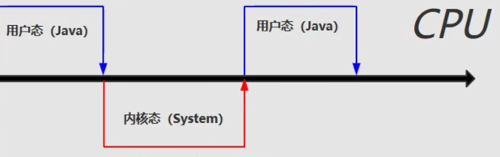
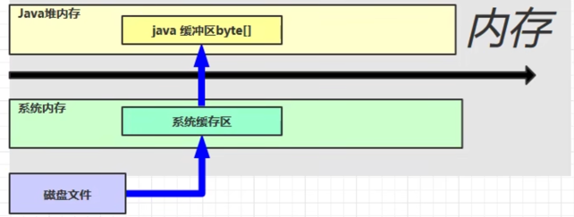
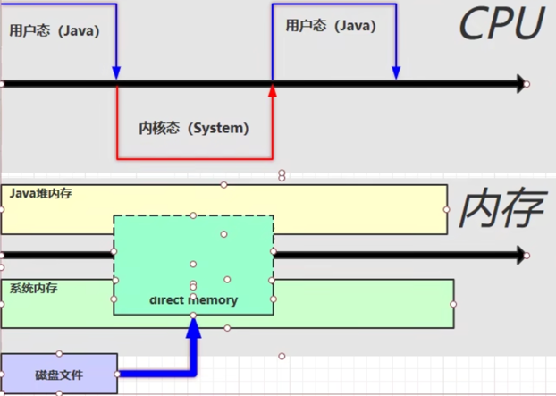

# 直接内存
## 1.定义
不属于jvm，属于系统内存。
* 常用于NIO操作，用于数据缓冲区
* 分配 回收 成本较高，但是读写性能高
* 不受JVM内存回收管理

## 2.读写性能

### 1.普通IO

Java是没有办法直接读取磁盘空间的，在执行IO的时候，实际上是Java调用了本地方法，让系统去调用磁盘空间，此时，CPU从Java切换到了系统。

在系统调用磁盘空间的时候，会在**操作系统**的系统内存中，划分出一块**系统缓冲区**，把磁盘内容读入系统缓冲区中（分批次）。
但是在系统缓冲区中，Java代码是不能运行的，所以Java会在堆内存中，开辟出一块Java的缓冲区（new byte[1024]），然后将系统缓冲区的内容读入到Java缓冲区中。
此时，CPU又切换到用户态，Java就可以执行write操作了。

### 2.DirectIO
直接内存，在执行 ByteBuffer.allocateDirect(1024) 的时候 就会申请一块Direct Memory空间。

